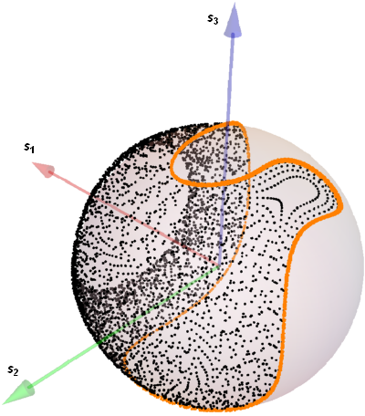

## **Spherical_Midpoint_Demo**

C++ Demo Class for a symplectic integrator on spheres. This is a "spherical midpoint" method, demonstrated at https://journals.aps.org/pre/abstract/10.1103/PhysRevE.89.061301 . The original article contains a python notebook with the solver, but this demo is far simpler and "raw" enough to adapt into other open source projects. For instance, simulators in the field of magnetism like [OOMF](https://math.nist.gov/oommf/software.html), [MuMax3](https://mumax.github.io/) and [VAMPIRE](https://vampire.york.ac.uk/) are all built using C++/CUDA code.

The integrator is given by the following expression

)

Where the  are the analogous to the midpoint rule for the case of noncanonical Hamiltonians, e.g spin systems defined on the spheres product %5EN), and the index 'i' refers to space whereas 'n' refers to time. They are written as

And the general equation we are solving is a particular case of Nambu system, which to the less mathematically inclined, in this case is simply given by the precession of a vector field about an effective Hamiltonian field, namely

%20%3D%20%5Ctextbf%7Bf%7D(%5Ctextbf%7Bs%7D_1%2C%5Cldots%2C%5Ctextbf%7Bs%7D_N))

This demo class solves the general equation above applying the spherical midpoint method to a nonlinear perturbation of the spinning top, with Hamiltonian given by

%3D%5Cfrac%7B1%7D%7B2%7D%20%5Csum_%7Bj%3D1%7D%5E%7B3%7D%20%5Cfrac%7B1%7D%7BI_%7Bj%7D%7D%5Cleft(s_%7Bj%7D%5E%7B2%7D%2B%5Cfrac%7B2%7D%7B3%7D%20s_%7Bj%7D%5E%7B3%7D%5Cright)%2C%20%5Cquad%20I%3D(1%2C2%2C4))

This particular system is quite difficult to integrate and this demo compares the spherical midpoint method to the classical midpoint method. We can see that there is a substantial drift from periodic orbits in the case of the midpoint method (incorrect behavior), with only the spherical midpoint method accurately predicting the periodic orbits, in virtue of being symplectic for the phase space of the Hamiltonian. The midpoint method is strictly NOT symplectic for noncanonical Hamiltonians, even though it still preserves several symmetries and integrals of motion. A plot of both methods for a timestep of 0.5 can be used to visualize this difference:

Note how the spherical midpoint method trajectory (orange solid line) is periodic in phase space, while the classical midpoint trajectory is not, in spite of its other advantages. Both implicit integrators of this class are solved with a Predictor-Corrector scheme, with a predictor Euler step and a Corrector fixed-point iteration of the corresponding midpoint method.

This method can be extended to any [perturbation of] equation of the precession type described above, such as the classical Heisenberg Hamiltonian, spin chains, and discrete realizations of the Landau-Lifshitz-Gilbert equation. Because of its symplectic property and absolute stability surpassing even that of the classical midpoint method, the spherical midpoint method should be the choice of implementation in solutions of stochastic Langevin equations in magnetism. The [admagnus](https://github.com/mgmonteiro/admagnus) code uses it for general purpose micromagnetics, including homogeneous material current densities and stochastic temperature effects. A future implementation of this method in other open source packages is planned.

Compilation of this demo is standard for almost any compiler. If you use Windows a Visual Studio solution is available, otherwise Visual Studio Code or VSCodium should recognize all the files as well.
